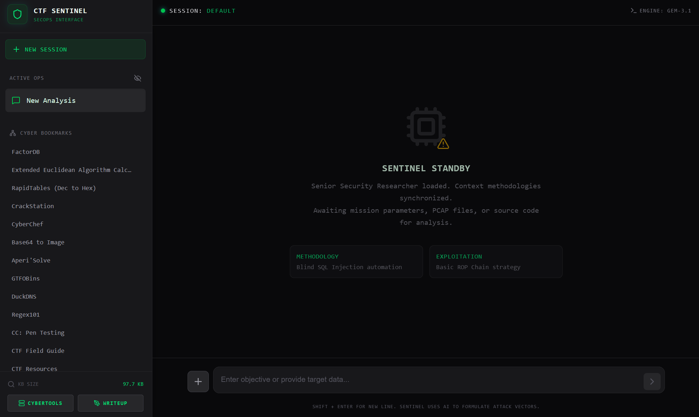

# 🛡️ CTF Sentinel - SecOps Interface

mail: domedg5@gmail.com

 <!-- SUGGERIMENTO: Aggiungere qui lo screenshot dell'avvio o della boot sequence! -->

## 📸 Screenshots & Showcase

### 🎥 Demo in Azione
[Guarda la Video-Demo di CTF Sentinel 🎬](Images/Demo_CTF-Sentinel.mov)

> *[INSERIRE QUI UNO SCREENSHOT DELL'INTERFACCIA GENERALE E DEI CYBER BOOKMARKS]*  
> 
> 
> *[INSERIRE QUI UNO SCREENSHOT DELLA CHAT CHE MOSTRA UN EXPLOIT BOX STILE CHATGPT E IL TASTO WRITEUP]*  
> 

CTF Sentinel è un'interfaccia avanzata, in stile "hacker"/SecOps, pensata per i professionisti della cybersecurity e i giocatori di CTF (Capture The Flag). Sfrutta la potenza dell'intelligenza artificiale (via Google Gemini) accoppiandola con strumenti locali di *ricognizione automatica* e analisi forense, velocizzando radicalmente la risoluzione dei challenge tecnici.

## ✨ Funzionalità Core espansive

  Appena carichi un file eseguibile, l'app lancia *dietro le quinte* uno script dedicato (`Utils/recon.py` che sfrutta checksec, strings, strace, objdump) e invia all'AI solo le informazioni decodificate salienti, aggirando il limite dei token o il bisogno di incollare log formattati malissimo dal terminale.
* **Autogenerazione Writeups 📝**  
  Terminata l'analisi di una challenge, la funzione "Writeup" redigerà e formatterà per te l'intero documento Markdown attingendo a tutto il contesto del task isolando Exploit ed Analisi logica in paragrafi, scaricandolo direttamente sul tuo PC archiviandolo nella cartella `/Writeups`.
* **Codice e Exploit isolati Stile ChatGPT**  
  Tutti i frammenti di codice e payload proposti dall'Intelligenza Artificiale sono isolati in riquadri autonomi (copiatili con un clic e pre-scaricabili coi file appropriati es. `.py` o `.sh`).
* **Cyber Bookmarks Dinamici**  
  Per usare Sentinel come desktop lavorativo, i tuoi tool OSINT, Web o Crypto preferiti sono a portata di click. Caricati interamente dalla lettura on-the-fly del file `Utils/Tools.md`.

## ⚙️ Requisiti di Sistema

Per far funzionare il progetto sulla tua macchina locale (strutturata idealmente per WSL o Linux), sono necessari:

- **Node.js** (v18 o superiore per avviare Vite e il server middleware React)
- **Python 3** (per lo script di recon integrato locale)
- **Toolchain Binaria Linux** raccomandata: `file`, `ldd`, `strings`, `readelf`, `objdump`, `hexdump`, `ltrace`, `strace`, `checksec`.
- Una **API Key valida di Google Gemini**, salvata rigorosamente in locale nel progetto.

## 🚀 Setup e Installazione

1. Clona questa repository:
   ```bash
   git clone <URL_REPOSITORy>
   cd ctf-sentinel
   ```
2. Installa le dipendenze NPM:
   ```bash
   npm install
   ```
3. Sicurezza API: crea all'interno della cartella principale un file `.env.local` (che **DEVE** essere mantenuto segreto e non caricato nel git) contenente:
   ```env
   GEMINI_API_KEY=inserisci_qui_la_tua_key
   ```
4. Avvia il server di sviluppo ibrido front/back:
   ```bash
   npm run dev
   ```
   *Oppure puoi lanciare lo sh dedicato se hai Unix: `./start.sh`.*


## 🧰 Struttura del Progetto / API

Trattandosi di un'app basata su Vite (che è un dev server nativo Node), sono stati scritti driver locali per comunicare col file system senza dover compilare veri e propri microservizi extra:

- `/src/App.tsx` -> Il cuore logico dell'interfaccia React, contiene hook, Markdown rendering logic e layout.
- `vite.config.ts` -> Oltre a buildare React, fa da **Middleware Express**. Intercetta per esempio rotta POST al `/api/writeup` (per il salvataggio file) e la POST al `/api/recon` (eseguendo *spawn* di child processes per lo script in Python nel OS).
- `/Utils/recon.py` -> Motore Python puramente Linux di ispezione statica e dinamica.
- `/Utils/Tools.md` -> Database testuale letto allo startup dei pannelli laterali.

## 🤝 Contributi
Il file `vite.config.ts` supporta benissimo modifiche! Sentitevi liberi di forkarlo per estendere `recon.py` con routine auto-dumper come *js-beautify* per il web o analizzatori log.
